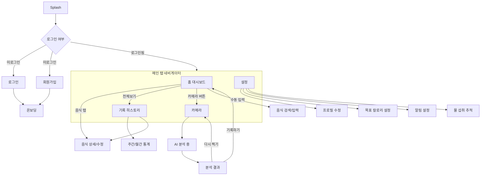

# CalSnap

> 음식 사진 한 장으로 칼로리를 추적하는 AI 기반 식단 관리 앱

## 소개

CalSnap은 음식 사진을 촬영하면 AI가 자동으로 음식을 인식하고 칼로리 및 영양소를 분석해주는 모바일 앱입니다.
일일 섭취 칼로리를 추적하고, 목표 대비 남은 칼로리를 한눈에 확인할 수 있습니다.

### 핵심 기능

- **AI 음식 인식** — 카메라로 음식을 촬영하면 GPT-4o Vision이 음식명, 칼로리, 영양소를 자동 분석
- **칼로리 추적** — 일일 목표 칼로리 대비 섭취량을 실시간으로 추적하고, 남은 칼로리를 표시
- **영양 통계** — 주간/월간 칼로리 트렌드, 영양소 비율, 자주 먹은 음식 TOP 5 등 시각화

---

## 기술 스택

### Frontend

| 기술                    | 버전 | 용도                    |
| ----------------------- | ---- | ----------------------- |
| Expo SDK                | 54   | React Native 프레임워크 |
| React Native            | 0.81 | 크로스 플랫폼 모바일 UI |
| TypeScript              | 5.9  | 타입 안전성             |
| expo-router             | 6    | 파일 기반 라우팅        |
| zustand                 | -    | 상태 관리               |
| StyleSheet              | 내장 | 스타일링                |
| react-native-reanimated | 4    | 애니메이션              |

### Backend

| 기술                     | 용도             |
| ------------------------ | ---------------- |
| NestJS                   | REST API 서버    |
| PostgreSQL               | 데이터베이스     |
| OpenAI GPT-4o Vision API | 음식 이미지 분석 |

### 배포 (예정)

| 플랫폼    | 용도                |
| --------- | ------------------- |
| EAS Build | Android/iOS 앱 빌드 |
| Railway   | NestJS 백엔드 배포  |

---

## 앱 플로우



---

## 화면 목록 (19개)

### 인증 플로우

| #   | 화면     | 파일 경로                   | 설명                                                 |
| --- | -------- | --------------------------- | ---------------------------------------------------- |
| 1   | 스플래시 | `app/index.tsx`             | 앱 진입점, 로고 표시 후 자동 리다이렉트              |
| 2   | 로그인   | `app/(auth)/login.tsx`      | 이메일/비밀번호 + 소셜 로그인 (Google, Apple, Kakao) |
| 3   | 회원가입 | `app/(auth)/signup.tsx`     | 이름, 이메일, 비밀번호, 비밀번호 확인                |
| 4   | 온보딩   | `app/(auth)/onboarding.tsx` | 성별, 나이, 키, 체중, 활동량 입력 → BMR 계산         |

### 메인 탭

| #   | 화면          | 파일 경로                 | 설명                                                     |
| --- | ------------- | ------------------------- | -------------------------------------------------------- |
| 5   | 홈 대시보드   | `app/(tabs)/index.tsx`    | 칼로리 프로그레스 링, 탄단지 카드, 오늘 먹은 음식 리스트 |
| 6   | 기록 히스토리 | `app/(tabs)/history.tsx`  | 주간 캘린더, 끼니별 기록, 일일 요약                      |
| 7   | 카메라 촬영   | `app/(tabs)/camera.tsx`   | 음식 촬영 가이드 프레임                                  |
| 8   | 설정          | `app/(tabs)/settings.tsx` | 프로필, 목표 설정, 알림, 앱 정보                         |

### 카메라 → 분석 플로우

| #   | 화면       | 파일 경로                  | 설명                                                 |
| --- | ---------- | -------------------------- | ---------------------------------------------------- |
| 9   | AI 분석 중 | `app/analysis/loading.tsx` | 촬영 후 AI 분석 로딩 애니메이션                      |
| 10  | 분석 결과  | `app/analysis/result.tsx`  | 음식명, 칼로리, 영양소 분석 결과, 기록하기/다시 찍기 |

### 음식 관리

| #   | 화면                | 파일 경로                | 설명                                |
| --- | ------------------- | ------------------------ | ----------------------------------- |
| 11  | 음식 검색/직접 입력 | `app/food/search.tsx`    | 음식 검색, 최근 검색, 직접 입력 탭  |
| 12  | 음식 상세 바텀시트  | (search.tsx 내 컴포넌트) | 인분 조절, 식사 시간 선택, 추가하기 |
| 13  | 음식 상세/수정      | `app/food/[id].tsx`      | 기록된 음식 수정, 인분 변경, 삭제   |

### 설정 서브 화면

| #   | 화면             | 파일 경로                       | 설명                                    |
| --- | ---------------- | ------------------------------- | --------------------------------------- |
| 14  | 프로필 수정      | `app/profile-edit.tsx`          | 이름, 성별, 나이, 키, 체중, 활동량 수정 |
| 15  | 목표 칼로리 설정 | `app/calorie-goal.tsx`          | 슬라이더 + AI 추천 (감량/유지/증가)     |
| 16  | 알림 설정        | `app/notifications-setting.tsx` | 끼니별 알림 시간, 물 마시기 알림 간격   |
| 17  | 물 섭취 추적     | `app/water-intake.tsx`          | 물잔 비주얼, 퀵 추가, 오늘의 기록       |

### 통계

| #   | 화면      | 파일 경로                   | 설명                                         |
| --- | --------- | --------------------------- | -------------------------------------------- |
| 18  | 주간 통계 | `app/statistics.tsx`        | 주간 칼로리 바 차트, 영양소 비율, TOP 5 음식 |
| 19  | 월간 통계 | (statistics.tsx 내 탭 전환) | 30일 트렌드 라인 차트, 월간 요약             |

---

## 시작하기

```bash
# 프로젝트 클론
git clone <repo-url>
cd calsnap

# 의존성 설치
npm install

# 개발 서버 실행
npx expo start

# Android
npx expo start --android

# iOS (Mac 필요)
npx expo start --ios
```

---

## 라이선스

MIT
